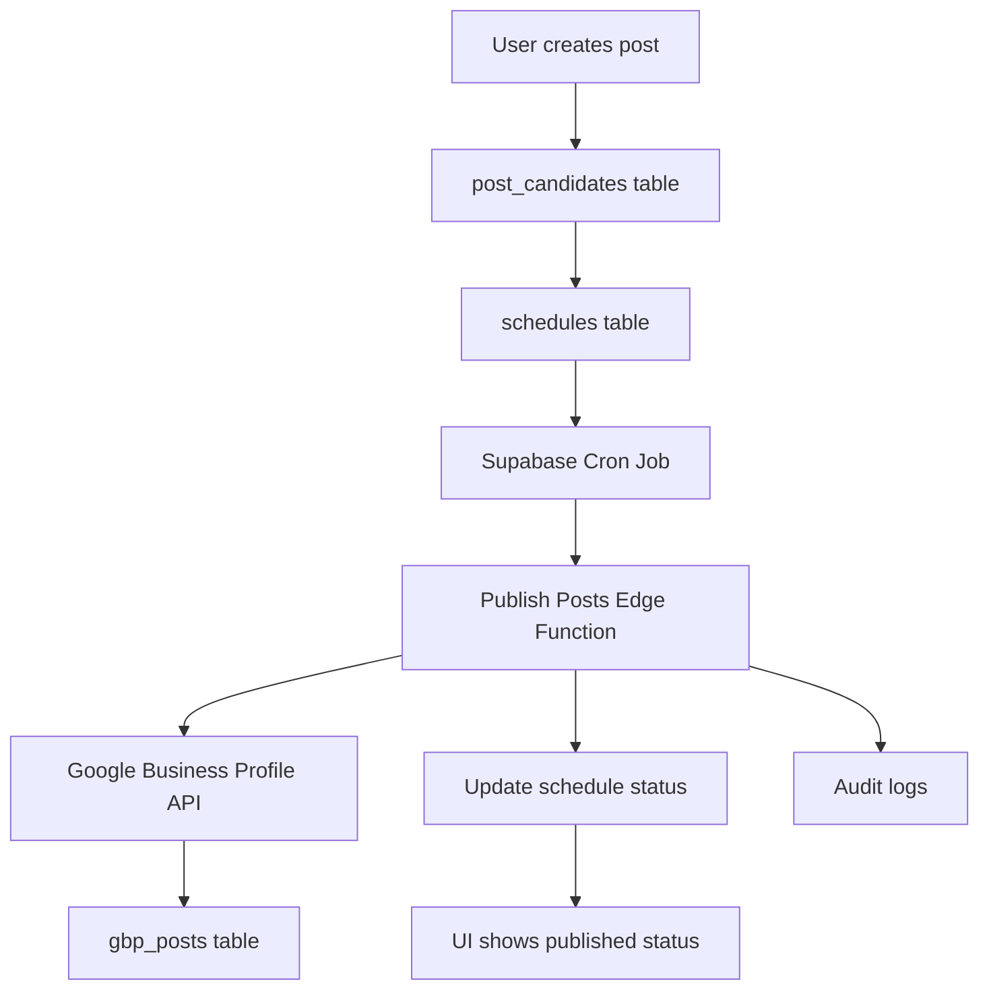

# Post Publishing System Documentation

## Overview

This document describes the complete post publishing system that automatically publishes scheduled posts to Google Business Profile (GBP). The system fills the critical gap between post creation and actual publication.

## Architecture



## Components

### 1. Database Tables

#### `post_candidates`

Stores the post content and metadata before publishing:

- `schema`: JSON object with post content (description, type, CTA, etc.)
- `images`: Array of base64-encoded images
- `status`: "pending", "approved", "rejected"

#### `schedules`

Manages when posts should be published:

- `target_type`: "post_candidate"
- `target_id`: References post_candidates.id
- `publish_at`: When to publish the post
- `status`: "pending", "published", "failed", "cancelled"
- `retry_count`: Number of retry attempts
- `last_error`: Last error message
- `next_retry_at`: When to retry failed posts

#### `gbp_posts`

Stores successfully published posts from Google:

- `google_post_name`: Google's post identifier
- `summary`: Post content
- `topic_type`: "STANDARD", "EVENT", "OFFER"
- `state`: "LIVE", "EXPIRED", "REJECTED"
- `search_url`: Direct link to view the post

#### `connections_google`

Encrypted Google OAuth tokens:

- `account_id`: Google account ID
- `refresh_token_enc`: Encrypted refresh token
- `scopes`: Authorized API scopes

### 2. Edge Function: `publish-posts`

Location: `supabase/functions/publish-posts/`

This is the core worker that:

1. Queries for pending schedules (including retries)
2. Decrypts Google OAuth tokens
3. Transforms post schema to Google API format
4. Publishes posts to Google Business Profile
5. Updates database with results
6. Handles retries with exponential backoff
7. Creates audit logs

**Features:**

- Runs every 5 minutes via cron job
- Processes up to 50 posts per run
- Retries failed posts up to 3 times
- Comprehensive error handling
- Audit logging for all operations

### 3. Cron Job Configuration

```toml
[[cron.jobs]]
name = "publish_posts"
schedule = "*/5 * * * *"
request.method = "POST"
request.url = "http://127.0.0.1:54321/functions/v1/publish-posts"
request.headers.Authorization = "Bearer env(PUBLISH_POSTS_CRON_SECRET)"
```

### 4. API Endpoints

#### Manual Publishing: `/api/posts/publish`

- `POST`: Manually trigger publishing for a specific schedule
- `GET`: Get publishing status for a location

#### Used by the UI for:

- Manual retry of failed posts
- Real-time status updates
- Publishing history

## Workflow

### 1. Post Creation Flow

1. User creates a post in the UI
2. Post is stored in `post_candidates` table
3. Schedule is created in `schedules` table with `publish_at` time
4. Status is set to "pending"

### 2. Automatic Publishing Flow

1. Cron job triggers Edge Function every 5 minutes
2. Function queries for pending schedules due for publishing
3. For each schedule:
   - Load post candidate and location data
   - Get Google OAuth credentials
   - Transform post schema to Google API format
   - Call Google Business Profile API
   - Store result in `gbp_posts` table
   - Update schedule status to "published" or "failed"
   - Create audit log entry

### 3. Error Handling and Retries

- Failed posts are marked with status "failed"
- Retry count is incremented
- Next retry time is calculated with exponential backoff
- After 3 failed attempts, post is permanently failed
- All attempts are logged in `audit_logs` table

## Post Schema Transformation

### Input (post_candidates.schema)

```typescript
{
  type: "WHATS_NEW" | "EVENT" | "OFFER",
  description: "Post content here",
  title: "Title (for EVENT/OFFER only)",
  cta: {
    action: "LEARN_MORE" | "CALL" | "BOOK" | "ORDER" | "SIGN_UP" | "SHOP",
    url: "https://example.com"
  },
  createdAt: "2025-01-01T00:00:00Z",
  authorId: "user-uuid"
}
```

### Output (Google API)

```typescript
{
  languageCode: "en",
  summary: "Post content here",
  topicType: "STANDARD" | "EVENT" | "OFFER",
  callToAction: {
    actionType: "LEARN_MORE",
    url: "https://example.com"
  },
  event: { // For EVENT posts
    title: "Title",
    schedule: {
      startDate: { year: 2025, month: 1, day: 1 }
    }
  },
  offer: { // For OFFER posts
    termsConditions: "Terms and conditions"
  }
}
```

## Security

1. **Authentication**
   - Cron secret protects Edge Function
   - Service role key for database operations
   - Row Level Security (RLS) on all tables

2. **Token Security**
   - Google refresh tokens are encrypted at rest
   - AES-256-GCM encryption with per-deployment keys
   - Tokens never exposed to client-side

3. **API Security**
   - All endpoints require authentication
   - Organization membership verified
   - Rate limiting respected

## Monitoring and Debugging

### 1. Logs

```bash
# View Edge Function logs
supabase functions logs publish-posts

# Check cron job execution
supabase db shell --command "SELECT * FROM audit_logs WHERE action LIKE 'post_publish%' ORDER BY created_at DESC LIMIT 10;"
```

### 2. Database Queries

```sql
-- Check pending schedules
SELECT * FROM schedules
WHERE status = 'pending'
AND target_type = 'post_candidate'
AND publish_at <= NOW()
ORDER BY publish_at;

-- Check failed posts
SELECT * FROM schedules
WHERE status = 'failed'
AND retry_count < 3
ORDER BY next_retry_at;

-- Check recent publications
SELECT * FROM gbp_posts
ORDER BY google_create_time DESC
LIMIT 10;
```

### 3. Common Issues

**Posts stuck in "pending" status:**

- Check if cron job is running
- Verify Edge Function is deployed
- Check for authentication errors

**Google API errors:**

- Verify OAuth scopes are correct
- Check if refresh token is valid
- Ensure location is properly connected

**High retry count:**

- Check Google API rate limits
- Verify post content meets GBP guidelines
- Check network connectivity

## Deployment

### 1. Initial Setup

```bash
# Deploy Edge Function
supabase functions deploy publish-posts

# Set required secrets
supabase secrets set PUBLISH_POSTS_CRON_SECRET=your_secret
supabase secrets set GOOGLE_CLIENT_ID=your_client_id
supabase secrets set GOOGLE_CLIENT_SECRET=your_client_secret
supabase secrets set GOOGLE_REFRESH_TOKEN_SECRET=your_32_char_secret

# Run database migration
supabase db push
```

### 2. Testing

```bash
# Run the test workflow
cd apps/web
npx tsx src/test-publish-workflow.ts

# Manual test via API
curl -X POST 'http://localhost:3000/api/posts/publish?scheduleId=your-schedule-id'
```

### 3. Verification

1. Create a test post in the UI
2. Check it appears in `schedules` table
3. Wait for cron job (or trigger manually)
4. Verify status changes to "published"
5. Check `gbp_posts` table for Google post reference
6. Verify post appears on Google Business Profile

## Maintenance

### Regular Tasks

1. Monitor failed posts and retry manually if needed
2. Check Google API quota usage
3. Review audit logs for unusual activity
4. Update OAuth tokens if they expire

### Performance Tuning

- Adjust batch size in Edge Function if needed
- Modify cron frequency based on volume
- Add more indexes if queries are slow
- Consider rate limiting for high-volume accounts

## Future Enhancements

1. **Image Handling**: Upload base64 images to CDN before sending to Google
2. **Post Updates**: Support updating existing posts
3. **Bulk Operations**: Batch publish multiple posts
4. **Advanced Scheduling**: Support recurring posts
5. **Analytics**: Track post engagement metrics
6. **Multi-platform**: Support other social media platforms
